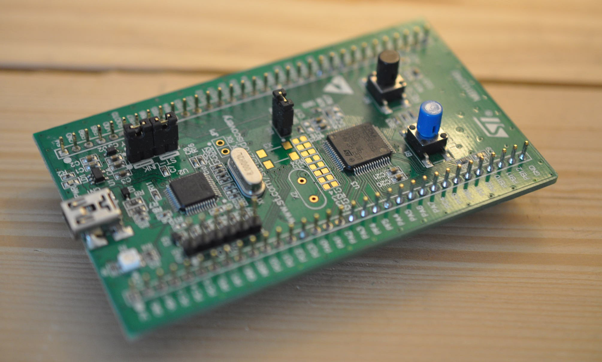

        
Some applications doesn't require powerful microcontroller, and most of times the examples give by the constructor are more complicated than the application wanted. These libraries are the result of a basic need, which is to design an application with few lines of code like the rock star [mbed](http://www.keil.com/arm/mdk.asp) !

These libraries are available on [GitHub](https://github.com/remidebord/STM32F0">GitHub, and can be easily used under [Keil](http://www.keil.com/arm/mdk.asp) (free version limit code to 20k). The most of the stm32f051 peripherals are availables (GPIO, ADC, USART, SPI, I2C, DAC) with examples and work with the discovery kit. How tos are availables soon !

Edit: Theses libraries are available for F2 and F4 !
